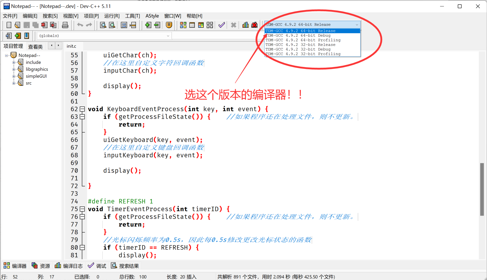

# 编译运行说明

## 编译说明

### 方法一

**适用于宇宙最强编译器 Dev-Cpp**

git 仓库或下载并解压仓库压缩包后，进入子文件夹 devcpp，打开工程文件 Notepad--.dev，即可使用 Dev-Cpp 进行编译运行。最终生成的 Notepad--.exe 将会在文件夹 devcpp 内。

清除编译中间文件：使用 Dec-Cpp 自带的清除功能。

**注意** Dev-Cpp的编译器要设置为64位的编译器，如下图所示：

### 方法二

**适用于配置过 MinGW 环境变量且安装 VSCode 的系统**

git 该仓库或下载并解压仓库压缩包后，用 VSCode 打开该文件夹（即 `.vscode` 文件夹所在的文件夹），之后使用快捷键 `Ctrl+Shift+B` 运行生成任务，即可在工作文件夹内生成目标程序 Notepad--.exe

注意：由于没有为 C 语言相关插件设置 CompilerPath，可能会导致提示一堆问题，但如果配置好环境变量，这不影响 mingw32-make 编译工程文件。你也可以在设置里搜索 `C_Cpp.default.compilerPath` 设置项并添加编译器路径。

清除编译中间文件：在 VSCode 终端中使用命令 `mingw32-make clean`。注意该方法也会删除目标文件 Notepad--.exe。您可自行修改 `Makefile` 文件来避免删除目标文件。

## 运行说明

在运行前右键 Notepad--.exe，选择属性 > 兼容性，在下方设置中点击 **更改高DPI设置** 按钮，在弹出的窗口中勾选下方的 **替代高DPI缩放行为**，并将最下面一个下拉菜单 **缩放执行** 由 **应用程序** 改为 **系统（增强）**。点击确定后再点击确定，保存设置后双击打开 Notepad--.exe

当然您也可以直接双击 Notepad--.exe 打开。上述过程只是为了让其能够更加适应高分辨率（有缩放倍率）的高清屏。