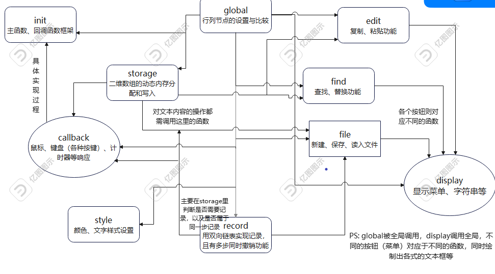
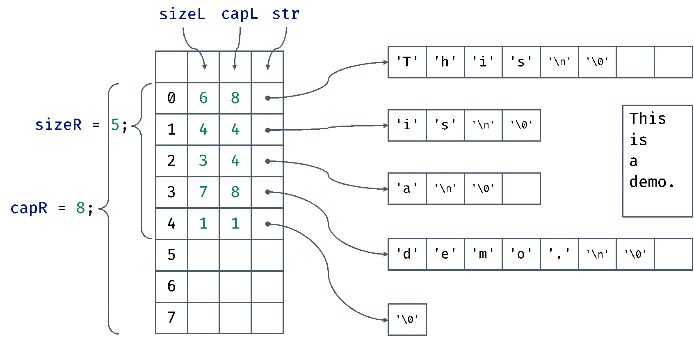

# 程序开发设计

## 总体架构设计


箭头表示被调用（文件中的函数被调用），即由被调用方指向调用方，其中 global 被全局调用，display 调用全局。各文件基本功能和调用关系如上图，当然每个 `*.c` 文件中都有自己调用的库函数，不计入内。

## 功能模块设计

Notepad-- 当中一共有10个模块，分别实现了初始化，回调，界面展示，文本编辑，查找替换，文件处理，全局控制，记录，储存，样式设计十个不同的功能。不同模块之间相互作用，共同实现了 Notepad-- 的丰富多样的功能。

1.	初始化模块
    - 实现了应用程序的初始化
    - 局部数据设计：设置局部变量 `winWidth`, `winHeight` 获取界面宽度高度

2.	回调模块
    - 主要处理鼠标，键盘按键的回调
    - 局部变量设计：设置记录鼠标键盘按键状态的静态局部变量

3.	界面展示模块
    - 主要包括文本的绘制，光标绘制，查找替换窗口绘制，格式字体选择的绘制
    - 局部变量设计：设置记录是否显示查找、替换、设置界面、键盘快捷键、关于、右键菜单的静态局部变量

4.	文本编辑模块
    - 主要实现复制、剪切、粘贴功能
    - 局部变量设计：无设置局部变量

5.	文件处理模块
    - 主要实现文件的新建、打开、保存、另存为功能
    - 局部变量设计：设置当前文件指针变量；设置存储文件名和文件保存创建状态的静态局部变量

6.	查找替换模块
    - 主要实现查找替换功能
    - 局部变量设计：设置记录是否重新扫描，判断替换选择的静态局部变量

7.	全局控制模块
    - 主要负责整个程序的设计和调控
    - 局部变量设计：设计记录窗口左上角坐标，光标所在位置坐标和选择范围坐标的静态局部变量

8.	记录模块
    - 实现文本操作记录，撤销，重做功能
    - 局部变量设计：设计指向链表头和尾，当前操作的指针

9.	储存模块
    - 用于处理字符串的储存操作
    - 局部变量设计：设计储存行、列方向所用总数和可承载总数的静态局部变量

10.	样式设计模块
    - 主要包括打开程序时的初始化图形界面，包括菜单，文本显示等
    - 局部变量设计：设计样式设计结构

## 数据结构设计

### 位置结构
```c
typedef struct {
    int row;    //行位置
    int column; //列位置
} RCNode;

RCNode windowCurrent;
RCNode cursor;
RCNode startSelect, endSelect;
```
- 使用样例：
    - `winCurrent`    窗口左上角
    - `cursor`        光标
    - `startSelect`   选择范围的起点
    - `endSelect`     选择范围的终点


### 文本内容储存结构
手撸 C++ 中的 `vector` 和 `string` 类来实现文本内容的存放

```c
unsigned int sizeR;     //纵向使用量
unsigned int capR;      //纵向可承载量
unsigned int *sizeL;    //横向使用量
unsigned int *capL;     //横向可承载量
char **str;             //储存内容字符串
```

纵向：`unsigned int sizeR; unsigned int capR;` 分别表示纵向的当前存放长度与最大存放长度。当 `sizeR > capR` 时，则将 `capR` 成（二）倍扩大，将旧的横向数据搬到按照新的 `capR` 新开的内存上，并释放旧的数据。

横向：`char **str; unsigned int *sizeL; unsigned int *capL;` 分别表示横向的字符串，当前存放长度与最大存放长度。与纵向类似，两倍扩大并搬运数据。

如下图，图中所示的即为右侧方框内的内容的储存样例。注意文末有一个空行。



### 操作记录存放结构
```c
typedef struct node {
    int op;             //操作类型
    int id;             //操作id
    RCNode pos;         //操作位置
    char *str;          //操作字符串
    struct node *next;  //下一个节点
    struct node *last;  //上一个节点
} linkedList;
linkedList *nodeHead, *nodeTail;
linkedList *curNode;
```
采用链表的结构记录操作的栈，记录操作、撤销与重做时进行相应的进出栈操作。

若连续的节点间id相同，则说明对应着同一步操作，用递归的方式进出栈。

### 函数设计描述

由于函数较多，仅摘录较为重要的函数。

#### 对 `libgraphic` 以及 `simpleGUI` 的修改

1. `genlib.c`
   - `void Error(string msg, …);`
    在函数中添加了一个 `MessageBoxA` 用于将程序的错误信息通过弹窗提示出来，而不是直接崩溃。

1. `graphics.c`
   - `static void InitDisplay(void);`
        1. 在定义添加用于添加窗口的样式类 `wndcls.style` 时添加一个参数 `CS_DBLCLKS`，使得 Windows 会在鼠标双击的第二次按下时给出 `WM_LBUTTONDBLCLK` 的回调信息。
        2. 在创建 `osBits` 时将其大小由当前设定窗口大小改为整个桌面的大小，使得在拉大窗口范围时也能在最初的窗口大小外显示内容。 
        3. 在创建窗口样式的 `style` 变量赋值时，只赋值 `WS_OVERLAPPEDWINDOW`，使创建的窗口带有最小化、最大化按钮。
   - `static LONG FAR PASCAL GraphicsEventProc(HWND hwnd, UINT msg, WPARAM wParam, LPARAM lParam);` 
        1. 对 `WM_GETMINMAXINFO` 回调信息进行监听，使得程序可以自定义最小的窗口大小，防止窗口过小导致图形界面绘制出现问题。
        2. 对 `WM_CLOSE` 事件进行监听，使得用户在未保存的状态下，点击程序右上角的关闭按钮时，程序可以询问用户是否选择保存。
   - `static void DoUpdate(void);` 
    在程序每一次刷新/每一次变化窗口大小时（即收到 `WM_PAINT` 事件时）会执行这个函数，此时重新获取窗口大小，使得之后画图时可以用新的窗口大小来绘图，适配窗口大小的变化。

1. `imgui.c`
   - `UIState getUIState();` 
    此为新增的函数，便于我们获取当前各种控件是否被选中等信息，以此能够更好地处理用户的鼠标、键盘等操作。
   - `int textbox(int id, double x, double y, double w, double h, char textbuf[], int buflen);`
        1. 当没有文本框被选中时，选为当前文本框，此时应该把上一次输入的字符清空，否则会将上一次输入的字符直接填到文本框中。 
        2. 当文字范围超过文本框后，只显示字符串末尾的部分文本，使得文本范围不会超过文本框。（适配中文）
   - `void drawBox(double x, double y, double w, double h, int fillflag, char *label, char labelAlignment, char *labelColor);;` 
    画带 `label` 的方框时先填上一层白色的底色。


#### `init.c`

```c
void Main();
```

- **功能描述：** 为程序的 `main` 函数，用于获取屏幕信息，初始化界面、储存文件和链表，以及注册回调函数
- **参数描述：** 无参数
- **返回值描述：** 无返回值
- **重要局部变量定义：** 无局部变量
- **原型定义保存：** 函数原型和定义保存在init.c文件当中
- **函数模块对应关系：** 用于程序初始化模块

#### `callback.c`

```c
void getMouse(int x, int y, int button, int event);
```

- **功能描述：** 自定义传入参数（如当前坐标，文字绘制范围，行高等） 实现根据当前的 `(x, y)` 坐标返回在文件中的行列坐标 `(r, c)`
- **参数描述：** 形参 `x，y` 为获取的坐标值，`button` 储存鼠标按键状态，`event` 存储鼠标状态
- **返回值描述：**  无返回值
- **重要局部变量定义和用途描述：** 
  * `double nx = ScaleXInches(x);` -> 存储x的位置
  * `double ny = ScaleYInches(y);` -> 存储y的位置
  * `double minY = fH * 1.4;` -> 设置字高
  * `double menuBarH = fH * 1.5;` -> 菜单高度
- **原型定义保存：** 函数原型保存在 `callback.c` 文件当中；定义保存在 `callback.h` 文件当中
- **函数模块对应关系：** 用于回调模块

```c
void inputChar(char ch);
```

- **功能描述：** 根据传入的字符，行列等，实现将输入的文字添加（插入）到当前文件中某行某列 `(r, c)` 的功能。
- **参数描述：** `ch` 存储传入的需要添加的字符
- **返回值描述：** 无返回值
- **重要局部变量定义和用途描述：** 
  * `RCNode startSelect = getSelectStartRC();` -> 选中开始坐标
  * `RCNode endSelect = getSelectEndRC();` -> 选中结束坐标
- **原型定义保存：** 函数原型保存在 `callback.h` 文件当中；定义保存在 `callback.c` 文件当中
- **函数模块对应关系：** 用于回调模块

```c
void inputKeyboard(int key, int event);
```

- **功能描述：**  
  * 根据传入的键盘输入，判断是否需要换行、退格等操作
  * 上下左右键时移动光标位置（即改变行列数）
  * `Shift+方向键` 时改变选择范围，并把光标放到选择范围开头
- **参数描述：** `key` 储存键盘事件，`event` 储存键盘状态
- **返回值描述：**  无返回值
- **重要局部变量定义和用途描述：** 
  * `RCNode cursor = getCursorRC();` -> 获取光标坐标
  * `int rowLen = getRowLength(cursor.row);` -> 获取每行长度
  * `string s = getRowContent(cursor.row);` -> 获取每行字符串
- **原型定义保存：** 函数原型保存在 `callback.h` 文件当中；定义保存在 `callback.c` 文件当中
- **函数模块对应关系：** 用于回调模块

#### `display.c`

```c
RCNode XYtoRC(int x, int y);
```

- **功能描述：** 将窗口的 `(x, y)` 像素坐标转换为行列坐标
- **参数描述：** 传入形参为窗口的像素坐标
- **返回值描述：**  返回转换后文本当中的行列坐标
- **重要局部变量定义和用途描述：** 
  * `int totl = ceil((oy + GetFontAscent() - minY) / h);` -> 窗口中显示的总行数
  * `RCNode mouse = (RCNode) {0, 0};` -> 鼠标坐标
- **原型定义保存：** 函数原型保存在 `display.h` 文件当中；定义保存在 `display.c` 文件当中
- **函数模块对应关系：** 用于系统界面展示模块

```c
void display();
```

- **功能描述：** 显示窗口内容
- **参数描述：** 无传入参数
- **返回值描述：** 无返回值
- **重要局部变量定义和用途描述：** 无局部变量
- **原型定义保存：** 函数原型保存在 `display.h` 文件当中；定义保存在 `display.c` 文件当中
- **函数模块对应关系：** 用于系统界面展示模块

#### `edit.c`


```c
void copyText();
```

- **功能描述：** 根据传入的起始行列坐标与终止行列坐标进行复制

- **参数描述：** 无传入参数

- **返回值描述：** 无返回值

- **重要局部变量定义和用途描述：** 
  
  * `RCNode startSelect = getSelectStartRC();` -> 获取选择文字起始坐标
  * `RCNode endSelect = getSelectEndRC();`   -> 获取选择文字结束坐标
  * `char *copystr=getContent(startSelect, endSelect);`  -> 获取选中文本
  * `LPSTR lpStr = (LPSTR)GlobalLock(hMen);`  -> 写入剪切板的内容

- **原型定义保存：** 函数原型保存在 `edit.h` 文件当中；定义保存在 `edit.c` 文件当中

- **函数模块对应关系：** 用于文本编辑模块

```c
void pasteText();
```

- **功能描述：** 根据传入的起始位置粘贴文本内容（即需要修改对应的文件）
- **参数描述：** 无传入参数
- **返回值描述：** 无返回值
- **重要局部变量定义和用途描述：** 
  * `RCNode startSelect = getSelectStartRC();` -> 获取选择文字起始坐标
  * `RCNode endSelect = getSelectEndRC();`   -> 获取选择文字结束坐标
  * `HGLOBAL hMem = GetClipboardData(CF_TEXT);` -> 获取剪切板内容
  * `int lens = strlen(pasteText);` -> 获得末端的行列位置
- **原型定义保存：**  函数原型保存在 `edit.h` 文件当中；定义保存在 `edit.c` 文件当中
- **函数模块对应关系：** 用于文本编辑模块

```c
void shearText();
```

- **功能描述：** 根据传入的起始行列坐标与终止行列坐标进行剪切；即需要先复制这段内容，再将其删除

- **参数描述：** 无传入参数

- **返回值描述：** 无返回值

- **重要局部变量定义和用途描述：** 
  
  * `RCNode startSelect = getSelectStartRC();` -> 获取选择文字起始坐标
  * `RCNode endSelect = getSelectEndRC();`   -> 获取选择文字结束坐标

- **原型定义保存：** 函数原型保存在 `edit.h` 文件当中；定义保存在 `edit.c` 文件当中

- **函数模块对应关系：** 用于文本编辑模块

#### `file.c`


```c
void openFile();
```

- **功能描述：** 
  * 打开一个文件
  * 和 Windows 交互
  * 打开后更新窗口左上角坐标
  * 更新 `currentString` 字符串
- **参数描述：** 无传入参数
- **返回值描述：** 无返回值
- **重要局部变量定义和用途描述：** 
  * 用到多个 `Commdlg.h` 库函数当中的变量，用于与 Windows 系统交互
- **原型定义保存：** 函数原型保存在 `file.h` 文件当中；定义保存在 `file.c` 文件当中
- **函数模块对应关系：**  用于文件处理模块

```c
void saveFile();
```

- **功能描述：** 
  * 保存当前打开的文件
  * 如果是新建的文件 要和 Windows 交互选择打开位置
  * 否则就存在之前的位置
- **参数描述：** 无传入参数
- **返回值描述：** 无返回值
- **重要局部变量定义和用途描述：** 
  * 用到多个 `Commdlg.h` 库函数当中的变量，用于与 Windows 系统交互
- **原型定义保存：** 函数原型保存在 `file.h` 文件当中；定义保存在 `file.c` 文件当中
- **函数模块对应关系：**  用于文件处理模块


```c
void exitApplication();
```

- **功能描述：** 退出时若未保存则提供选项 选择是否保存更改 
- **参数描述：** 无传入参数
- **返回值描述：** 无返回值
- **重要局部变量定义和用途描述：**
  * `int a=MessageBox(NULL,"是否保存更改？","notepad--",MB_YESNOCANCEL);` -> 用于设置保存选项，同时获取返回值
- **原型定义保存：**  函数原型保存在 `file.h` 文件当中；定义保存在 `file.c` 文件当中
- **函数模块对应关系：** 用于文件处理模块

#### `find.c`


```c
int findLastText(char *src);
```

- **功能描述：** 
  
  * 根据传入的字符串从光标位置（选择范围前）查找上一个匹配的字符串
  
  * 查找成功后更新选择范围为下一个匹配的字符串，并更新光标位置为选择范围末端，如果光标不在窗口内则更新窗口位置

- **参数描述：** 传入需要查找的字符串

- **返回值描述：** 查找成功返回`1`；否则返回`0`

- **重要局部变量定义和用途描述：**
  
  * `RCNode startSelect = getSelectStartRC();` -> 获取选中文本开始坐标
  * `RCNode endSelect = getSelectEndRC();` -> 获取选中文本结束坐标
  * `RCNode cursor = getCursorRC();` -> 获取光标位置

- **原型定义保存：** 函数原型保存在 `find.h` 文件当中；定义保存在 `find.c` 文件当中

- **函数模块对应关系：** 用于文本查找模块

```c
int findNextText(char *src);
```

- **功能描述：** 
  * 根据传入的字符串查找从当前光标位置开始的下一个匹配的字符串
  * 查找成功后更新选择范围为下一个匹配的字符串，并更新光标位置为选择范围末端，如果光标不在窗口内则更新窗口位置
- **参数描述：** 传入需要查找的字符串
- **返回值描述：** 查到找则返回1，没找到则返回0
- **重要局部变量定义和用途描述：** 
  * `int length = strlen(src);`  -> 计算查找字符长度
  * `int totalrow=getTotalRow();` -> 获取一行字符的长度
  * `RCNode findCursor;` -> 储存找到字符的坐标
- **原型定义保存：** 函数原型保存在 `find.h` 文件当中；定义保存在 `find.c` 文件当中
- **函数模块对应关系：**  用于文本查找模块

```c
int replaceText(char *src, char *tar);
```

- **功能描述：** 
  * 根据传入的两个字符串（这里假设 `src` 为原先的字符串, `tar` 为替换成的字符串）进行替换操作
  * 替换完成后刷新显示，并更新选择范围为替换后的字符串，且更新光标位置为选择位置末端
  * 如果当前选中的字符串不是 `src` ，则先查找光标后的下一个符合的 `src` 并选中，即先执行`findText(src)`
  * 否则如果当前选中的字符串就是 `src`，则替换为 `tar` 并将选择范围改为替换后的字符串并更新光标位置为选择位置末端吗
- **参数描述：** `src` 储存原先的字符串，`tar` 为要替换成的字符串
- **返回值描述：** 查找替换成功返回1，失败返回0
- **重要局部变量定义和用途描述：** 
  * `RCNode startSelect = getSelectStartRC();` -> 获取选中文本开始坐标
  * `RCNode endSelect = getSelectEndRC()；` -> 获取选中文本结束坐标
  * `int findflag=1;` -> 是否找到字符
- **原型定义保存：** 函数原型保存在 `find.h` 文件当中；定义保存在 `find.c` 文件当中
- **函数模块对应关系：** 用于文本查找模块

#### `global.c`

```c
int RCcompare(RCNode start,RCNode end);
```

- **功能描述：** 
  - 判断两个行列坐标的前后关系
- **参数描述：** `start` 为第一个坐标，`end` 为第二个坐标。
- **返回值描述：** `-1` 则第一个在第二个前，`0` 则在同一个位置，`1` 则第二个在第一个前
- **重要局部变量定义和用途描述：** 
  - 无
- **原型定义保存：** 函数原型保存在 `global.h` 文件当中；定义保存在 `global.c` 文件当中
- **函数模块对应关系：** 用于全局处理模块

```c
RCNode endPos(RCNode startPos, char *str);
```

- **功能描述：** 
  - 计算传入字符的结束坐标
- **参数描述：** 传入开始的坐标 `startPos` 与中间的字符串 `str`
- **返回值描述：** 返回结束坐标。
- **重要局部变量定义和用途描述：** 
  * `RCNode nextPos = startPos;` ->字符串结束位置
  * `char *p = (char*)malloc(sizeof(str));` ->暂时储存字符串
  * `char *pp = p;` ->指向字符串的指针
- **原型定义保存：** 函数原型保存在 `global.h` 文件当中；定义保存在 `global.c` 文件当中
- **函数模块对应关系：** 用于全局处理模块

```c
void *mallocDIY(size_t size);
```

- **功能描述：** 
  - 带警告（开不了内存时`MessageBox` 弹窗并关闭应用）的malloc
- **参数描述：** 要开的内存空间大小 `size`
- **返回值描述：** 开的内存空间首地址值
- **重要局部变量定义和用途描述：** 
  - 无
- **原型定义保存：** 函数原型保存在 `global.h` 文件当中；定义保存在 `global.c` 文件当中
- **函数模块对应关系：** 用于全局处理模块

#### `record.c`


```c
void record(int op, RCNode pos, string str);
```

- **功能描述：** 记录每次操作到双向链表当中

- **参数描述：** 
  * `op` 操作类型: `OP_ADD` 添加字符串 `OP_DELETE` 删除字符串
  * `pos` 操作位置
  * `str` 添加/删除的字符串
- **返回值描述：** 无返回值
- **重要局部变量定义和用途描述：** 
  * `linkedList *temNode;` -> 创建储存目前操作的节点
- **原型定义保存：** 函数原型保存在 `record.h` 文件当中；定义保存在`record.c` 文件当中
- **函数模块对应关系：** 用于记录模块

```c
void undo();
```

- **功能描述：** 实现撤销功能
- **参数描述：**无传入参数 
- **返回值描述：** 无返回值
- **重要局部变量定义和用途描述：**
  * `RCNode nextPos = endPos(curNode->pos, curNode->str);` ->字符串结束位置
- **原型定义保存：** 函数原型保存在 `record.h` 文件当中；定义保存在`record.c` 文件当中
- **函数模块对应关系：** 用于记录模块

```c
void redo();
```

- **功能描述：** 实现重做功能
- **参数描述：** 无传入参数 
- **返回值描述：** 无返回值
- **重要局部变量定义和用途描述：**
  * `RCNode nextPos = endPos(curNode->pos, curNode->str);` ->字符串结束位置
- **原型定义保存：** 函数原型保存在 `record.h` 文件当中；定义保存在`record.c` 文件当中
- **函数模块对应关系：** 用于记录模块

#### `storage.c`


```c
string getContent(RCNode start, RCNode end);
```

- **功能描述：** 获得选中范围的字符串（为新建字符串，可修改）
- **参数描述：** 传入选中开始坐标和结束坐标
- **返回值描述：** 返回选中的字符串
- **重要局部变量定义和用途描述：** 
  * `char *res = (char *) malloc(sizeof(char) * (len + 1));` -> 用于储存字符串
- **原型定义保存：** 函数原型保存在 `storage.h` 文件当中；定义保存在 `storage.c` 文件当中
- **函数模块对应关系：** 用于储存模块

```c
void addContentByChar(RCNode pos, char ch, int recordID);
```

- **功能描述：** 添加字符
- **参数描述：** 
  * `pos`:添加的位置
  * `ch`:添加的字符
  * `recordID`:操作的对应 ID   特别地，如果传入的 `recordID` 为 `0` 则不记录操作
- **返回值描述：** 无返回值
- **重要局部变量定义和用途描述：**
  * `char * *tmpStr = (char **) malloc(sizeof(char *) * capR);` -> 分配空间储存字符
  * `unsigned int *tmpSizeL = (int *) malloc(sizeof(unsigned int) * capR);` -> 字符串长度
  * `unsigned int *tmpCapL = (int *) malloc(sizeof(unsigned int) * capR);` -> 储存空间容量
- **原型定义保存：** 函数原型保存在 `storage.h` 文件当中；定义保存在 `storage.c` 文件当中
- **函数模块对应关系：** 用于储存模块

```c
void addContentByString(RCNode start, string src, int recordID);
```

- **功能描述：** 添加字符串
- **参数描述：** 
  * `start`:起始位置
  * `src`:添加的字符串
  * `recordID`:操作的对应 ID   特别地，如果传入的 `recordID` 为 `0` 则不记录操作
- **返回值描述：** 无返回值
- **重要局部变量定义和用途描述：** 
  * `string addStr = (char *) malloc(sizeof(char) * (lens + 1));` -> 储存插入字符串
- **原型定义保存：** 函数原型保存在 `storage.h` 文件当中；定义保存在 `storage.c` 文件当中
- **函数模块对应关系：** 用于储存模块

```c
void deleteContent(RCNode start, RCNode end, int recordID);
```

- **功能描述：** 删除内容
- **参数描述：** 
  * `start`:起始位置
  * `end`:终止位置
  * `recordID`:操作的对应 ID   特别地，如果传入的 `recordID` 为 `0` 则不记录操作
- **返回值描述：** 无返回值
- **重要局部变量定义和用途描述：** 
  * `string addStr = (char *) malloc(sizeof(char) * (lens + 1));` -> 储存插入字符串
- **原型定义保存：** 函数原型保存在 `storage.h` 文件当中；定义保存在 `storage.c` 文件当中
- **函数模块对应关系：** 用于储存模块

#### `style.c`


```c
int defineColorRGB(char *des, char *rgb);
```

- **功能描述：** 用十六进制颜色码定义新颜色
- **参数描述：** 
- **返回值描述：**定义成功返回`1` ；失败返回 `0`
- **重要局部变量定义和用途描述：** 
  - 无
- **原型定义保存：** 函数原型保存在 `style.h` 文件当中；定义保存在 `style.c` 文件当中
- **函数模块对应关系：** 用于风格设计模块

```c
void initDisplay();
```

- **功能描述：** 初始化展示窗口
- **参数描述：** 无传入参数
- **返回值描述：** 无返回值
- **重要局部变量定义和用途描述：** 
  * `FILE *styleFile;` -> 读取用户风格配置文件
- **原型定义保存：** 函数原型保存在 `style.h` 文件当中；定义保存在 `style.c` 文件当中
- **函数模块对应关系：** 用于风格设计模块

### 文件组织
```
├─include
│      callback.h
│      display.h
│      edit.h
│      file.h
│      find.h
│      global.h
│      init.h
│      libgraphics.h
│      record.h
│      storage.h
│      style.h
│
├─libgraphics
│      boolean.h
│      exceptio.c
│      exception.h
│      extgraph.h
│      gcalloc.h
│      genlib.c
│      genlib.h
│      graphics.c
│      graphics.h
│      linkedlist.c
│      linkedlist.h
│      random.c
│      random.h
│      simpio.c
│      simpio.h
│      strlib.c
│      strlib.h
│
├─simpleGUI
│      imgui.c
│      imgui.h
│      origin_imgui
│
└─src
        callback.c
        display.c
        edit.c
        file.c
        find.c
        global.c
        init.c
        record.c
        storage.c
        style.c
```

Notepad-- 程序一共包含 20 个文件，其中`.c`文件 10 个，`.h` 文件 10 个，实现文件和模块一一对应，结构清晰。

