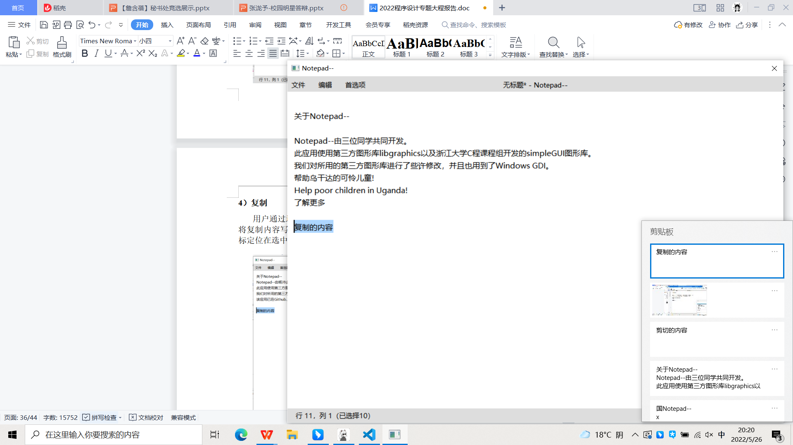

# 用户使用手册

## 使用界面介绍

Notepad-- 的操作主界面与 Windows 系统的**记事本**相似，程序打开即为编辑界面。界面上方为菜单栏，设置“文件”，“编辑”，“首选项”三个版块。菜单栏正中间为文件名，程序打开默认为未保存的新文件。界面右下角现实当前光标所在的行列数，左下角显示编码类型，强制GB 2312（受限于libgraphics）。

在打开的窗口中可以直接开始在无标题文档中编辑文字，正如您使用 Windows 记事本那样。

您也可以对界面进行自由的缩放、最小化以及最大化操作。程序也包含有右键菜单。

## 文件操作介绍

Notepad-- 实现了基础的文件操作功能。在任务栏当中打开“文件”菜单，可以选择文件的各项功能，也可以通过相应的快捷键进行操作。

### 新建文件

选择“新建”按钮，点击后程序实现与 Windows 系统的交互，自动跳出选择保存地址和文件类型的窗口，用户可以按照需要对新建文件进行保存。

### 打开文件

选择“打开”按钮，点击后程序实现与 Windows 系统的交互，自动跳出打开系统文件的窗口，用户可以直接打开电脑当中保存的文本文件并进行编辑。

### 保存或另存为文件

在打开或者已经有保存路径的文件当中进行编辑后，选中菜单当中的“保存”按钮，可以对编辑内容进行保存。如果文件为新建文本，在点击保存之后会自动跳出另存为的界面，用户再进行保存路径选择。

在完成文件编辑操作之后可以对文件进行另存为操作，点击“另存为”将文件另存到制定路径。

### 退出应用

若退出时应用为保存，会出现弹窗提示。

## 文本编辑操作介绍

### 界面操作

#### 文本输入

在 Notepad-- 的操作界面可以之间实现文本的输入和删除，文本内容同时支持中文和英文字符。

#### 光标定位

使用鼠标点击所需文本位置可以将光标自动定位到字符之间，在行末点击光标自动定位到该行最后一个字符后位置。左下角自动更新光标所在行列坐标。

此外，如果光标位置超出界面显示范围，界面会自动将页面跳转到光标位置。

#### 文本选中

通过鼠标的选中拖动可以实现文本段落的选中，显示界面自动修改选中文字底色，左下角坐标显示为选中结束坐标，同时增加已选择字符数的显示。如果选中内容包括换行，则在行末增加一个字符的宽度的选中表示换行符的选中。

此外，用户可以通过将光标定位后，利用键盘的上下左右移动按键选中周围文字。如果用户双击鼠标，将会选中整个单词（若是中文则会选中整个句子）。

#### 界面滚动

除了光标选中直接跳转页面，用户可以通过鼠标的滚动来实现界面的上下平移，使用 `Shift`+鼠标滚动实现左右平移。

如果选中内容范围超出界面，界面会跟随选中的范围进行滚动。

### 文本内容编辑

Notepad-- 实现了包括撤销、重做、剪切、复制、粘贴、查找、替换、全选等文本编辑功能，可以通过任务栏“编辑”菜单进行操作，也可以通过键盘快捷键进行操作。

#### 撤销与重做

在完成了一次编辑之后，可以通过撤销操作取消本次编辑。撤销后光标定位在上次操作位置。如果是撤销删除字符串的操作，撤销后自动选中添加的字符串。

在进行撤销操作之后，可以通过重做操作对刚刚撤销的操作进行重新完成。重做后光标定位在本次操作位置。如果是重做添加字符串的操作，重做后自动选中添加的字符串。

#### 剪切

用户可以通过选中需要剪切的文字对文本内容进行剪切操作，完成剪切操后程序会将剪切内容写入 Windows 系统剪切板，在其他程序当中仍然可以使用。光标定位在剪切删除的位置。

#### 复制

用户通过选中需要复制的文字对文本内容进行复制操作，完成复制后程序会将复制内容写入 Windows 系统剪切板，在其他程序当中仍然可以调用使用。光标定位在选中位置结束处。

#### 粘贴

用户通过菜单或者快捷键进行粘贴操作，可以直接实现系统剪切板内容的读取粘贴。如果是定位光标位置进行粘贴操作，则在该位置增加字符；如果是选中内容后执行粘贴操作，则是将选中内容删除后再将粘贴内容插入。

#### 查找

点击菜单“查找”按钮可以对需要查找内容进行整个文档范围的查找。点击后界面右上角会出现查找的操作栏，在文本输入框中输入需要查找的字符，点击 `↓` 或 `↑` ，程序从当前光标位置开始进行“下一个”或“下一个”字符的查找，找到后自动将字符选中。若查找到的字符位置坐标不在当前界面的显示范围以内，页面会自动跳转到查找文字所在位置进行显示。在查找到达文本末端后，会返回文本开头继续进行查找，直到查找到最初光标所在位置，实现文本的遍历查找。

如果没有查找到，则显示无结果

#### 替换

点击菜单“查找”按钮之后，界面右上角会显示替换窗口。上方输入查找内容，下方输入框输入替换内容。在查找后自动选中找到的内容，点击下方替换按钮后将内容替换为要求文本，同时自动选中查找到下一处内容。查找方式与查找操作相同。同时也可以使用全部替换。

#### 全选

在通过快捷键或者菜单进行全选操作后界面选中文件当中所有内容，光标定位在文本末端。

## 设置与关于

除了实现文件处理和文本编辑的基础内容以外，还设置了首选项菜单，用户可以在里面进行设置字体段落，进行键盘快捷键查询，查找相关等内容。

### 设置

打开菜单内的“设置”，可以设置字体类型、大小、行间距、文字颜色和背景颜色。点击查询颜色码按钮则可以跳转到相关的网页，便于用户查找。同时，在设置界面的下方，也有实例文本的设置范例展示，来方便用户对文本进行模拟修改。在点击左上角或使用快捷键退出这一界面时，设置的内容会自动保存到同文件夹下的 `styleConfig.properties` 文件中，下一次打开程序会自动读取文件并设置风格。

### 键盘快捷键

在任务栏的“首选项”当中也可以查询键盘快捷键，方便用户在使用时提高使用效率。

### 关于

在菜单当中也有“关于Notepad--”的展示界面来为用户介绍该程序的研发团队和用到的相关库文件。同时也表现出我们对乌干达儿童的关心，用户也可以通过点击了解更多按钮跳转到相关界面。（致敬Vim）

### 帮助

如果对程序的实现需要帮助，用户也可以点击“首选项”菜单当中的帮助一栏，跳转到相关界面。