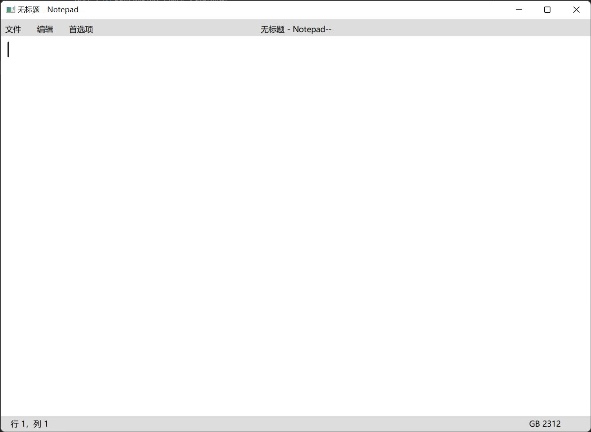

# 大程验收报告

## 快速开始：

 - [大程序简介](INTRODUCTION.md)
 - [程序开发设计](DESIGN.md)
 - [编译运行说明](COMPILE_RUN.md)
 - [用户使用手册](MANUAL.md)
 - [团队合作](TEAMWORK.md)

## 参考资料

 - docs.microsoft.com
   - 主要用于查阅 win32api函数如何使用
 - stackoverflow.com 以及 google.com
   - 主要用于查找遇到的有关 win32api 的问题如何解决
 - docs.github.com
   - 主要用于学习Github以及Git的使用